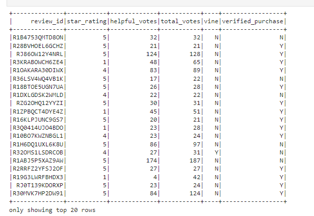
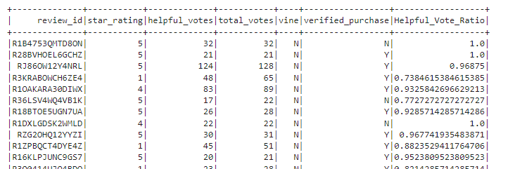
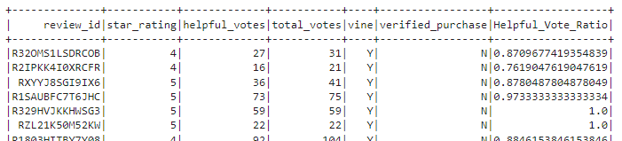
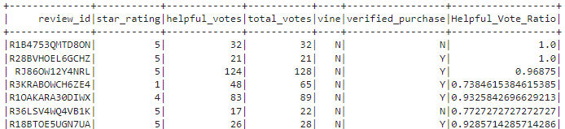

# Amazon_Vine_Analysis

## Overview Of Analysis

### Purpose and Scope
The purpose of this analysis is to determine if compensated reviewers as part of the Amazaon Vine program provide biased reviews for products.  The scope was limited to one data set of Amazon reviews from large list of available datasets.  For this particular review the following dataset was used:

https://s3.amazonaws.com/amazon-reviews-pds/tsv/amazon_reviews_us_Sports_v1_00.tsv.gz

### Analytical Methods

The analysis consisted of a four step process:
- Isoloate all reviews with more than 20 votes to filter out less relevant reviews
- Capture ratings where helpful votes were more than half the total votes to further reduce the dataset
- Divide the votes into Vine(Paid) and non-Vine(unpaid) reviews
- Calculate the percentage of five star reviews for Vine and non-Vine to exmaine for bias

#### Step 1 Isoloate Vine reviews with more than 20 Votes

The data was read fromt the Amazon tab delimited file into a dataframe - vine_df and also filtering the data for more than 20 total votes.  A sample of the resulting data frame is shown below.

#### Step 2 Capture Ratio of Helpful Votes to Total Votes greather than 50%

In order to accomplish Step 2 of the analysis a field called Helpful_Vote_Ratio was calcualated as helpful_votes / total_votes and was then filtered for all rows greater than 50%.  This dataframe(helpful_df) is shown below.

#### Step 3 Seperate Pain vs. UnPaid Reviews

To seperate Vine-Paid reviews from non-Vine unpaid reviews the "vine" column of the dataframe was filtered by "Y" or "N" into seperate dataframes.  Paid reviews, vine="Y", were seperated into the paid_df data frame.  Unpaind reviews, vine="N", were seperated into the unpaid_df dataframe.  Examples of both are shown below.

**Paid Reviews**

**Unpaid Reviews**

